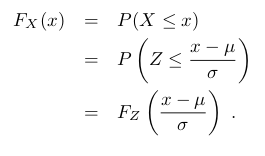

# Probability
Inspired in this [course](https://ocw.mit.edu/courses/18-440-probability-and-random-variables-spring-2014/pages/syllabus/).
## Distributions 

### Bernoulli
Random experiment executed multiple independent times under the same conditions with a result of failure or success with constanst probability. P = (p^k)*(q^(n-k))

### Binomial 
The distribution of random variable which counts the number of heads which occur when a coin is tossed n times, assuming that on any toss, the prob that a head occurs is p. k is the number of heads e q = 1-p.

### Geometric
Consider a Bernoulli trials process continued for an infinite number of trials; for
example, a coin tossed an infinite sequence of times. For example, let T be the number of trials up to and including the first success. Then:

### Hypergeometric
Suppose that we have a set of N balls, of which k are red and N − k are blue. We
choose n of these balls, without replacement, and define X to be the number of red
balls in our sample. The distribution of X is called the hypergeometric distribution.
We note that this distribution depends upon three parameters, namely N , k, and
n. There does not seem to be a standard notation for this distribution; we will use
the notation h(N, k, n, x) to denote P (X = x). This probability can be found by
noting that there are

different samples of size n, and the number of such samples with exactly x red balls
is obtained by multiplying the number of ways of choosing x red balls from the set
of k red balls and the number of ways of choosing n − x blue balls from the set of
N − k blue balls. Hence, we have

## Densities
### Normal Density
Central Limit Theorem: the sum of infinite random variables follows a normal distribution.

